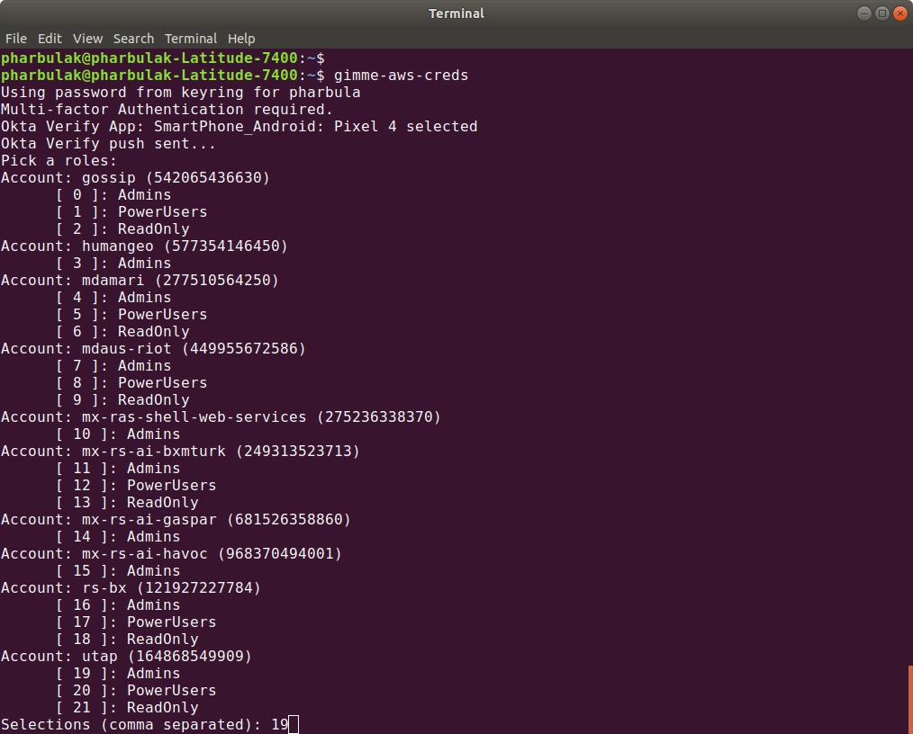

# Role-based AWS CLI Access Using gimme-aws-creds
*"A CLI that utilizes Okta IdP via SAML to acquire temporary AWS credentials"*

## Install and Configure

* Install [gimme-aws-creds](https://github.com/Nike-Inc/gimme-aws-creds):

    ```
    pip3 install --upgrade gimme-aws-creds
    ```

* Backup AWS credentials file

    ```
    mv ~/.aws/credentials ~/.aws/credentials.orig
    ```

* Save gimme-aws-creds [config file](./.okta_aws_login_config) (to ~/.okta_aws_login_config) or skip to step 4 to manually configure

* Manually configure gimme-aws-creds

    ```
    gimme-aws-creds --action-configure
    ```

## Get Credentials for AWS CLI

* Execute `gimme-aws-creds`



* Use profile for executing AWS CLI commands

    ```
    aws s3 ls --profile utap-Admins
    ```

* Or set default profile to one of the profiles updated by gimme-aws-creds

    ```
    export AWS_DEFAULT_PROFILE=utap-Admins
    aws s3 ls
    ```